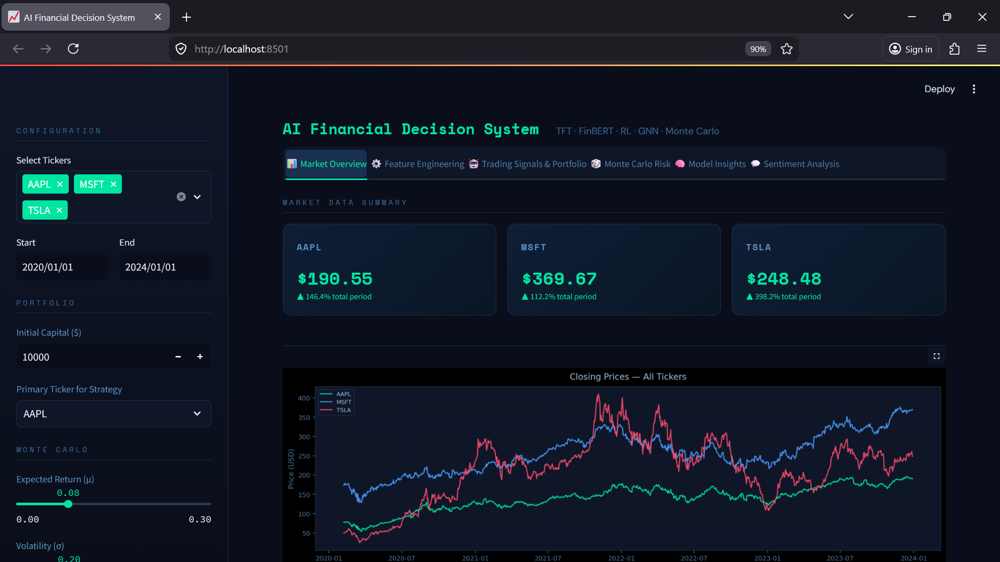
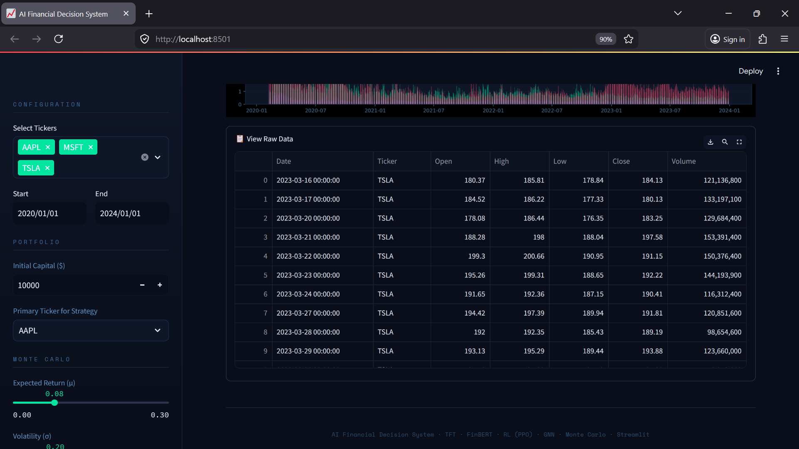
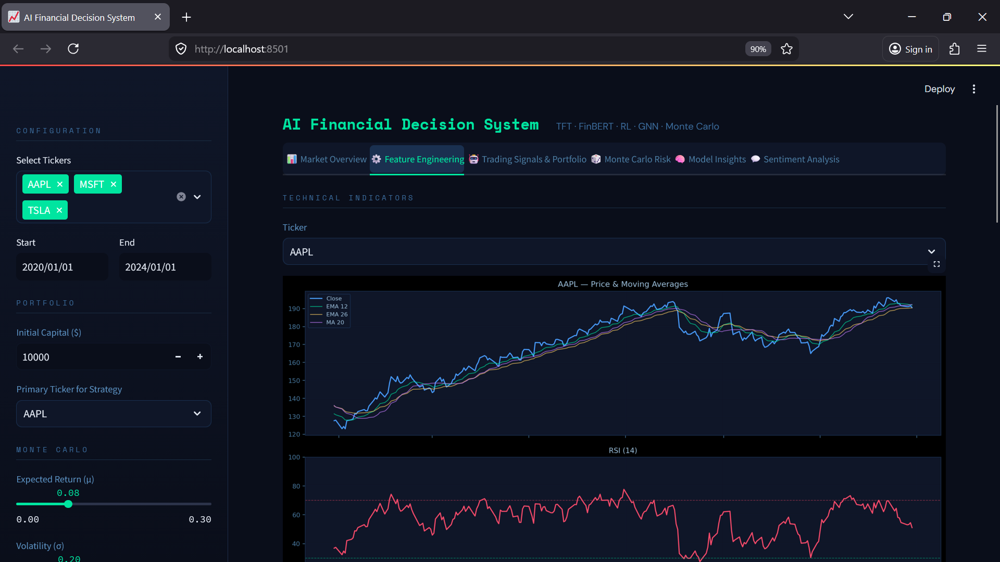
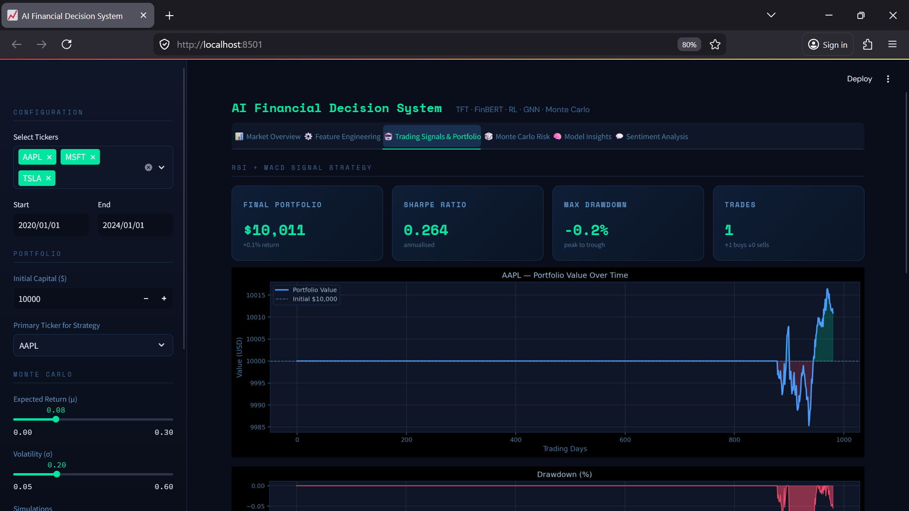
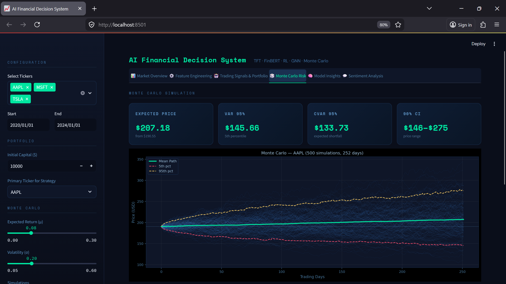
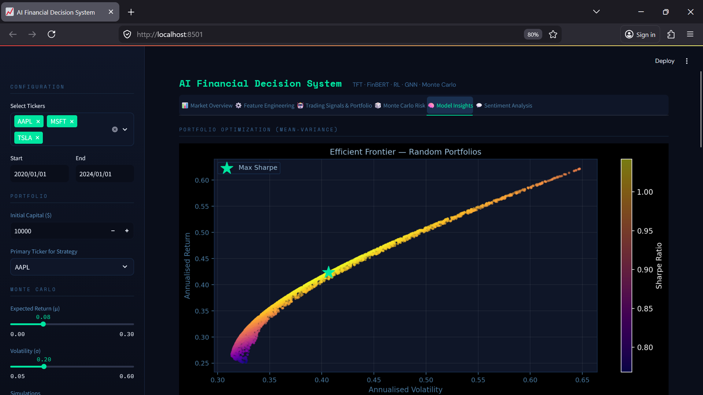
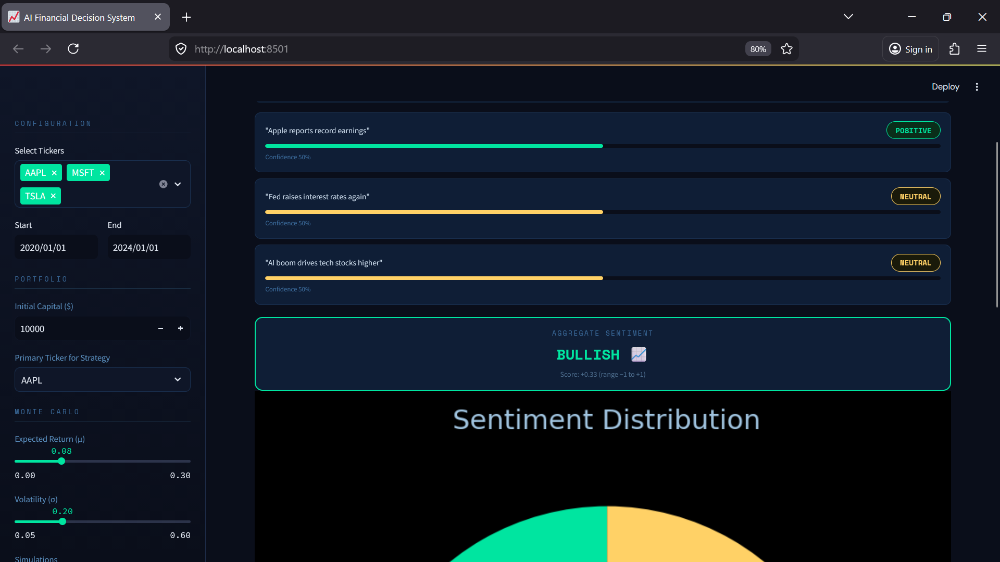

#  AI Financial Decision System using Temporal Fusion Transformer and Market Sentiment Analysis


---

##  Overview

The AI Financial Decision System is an advanced, end-to-end machine learning framework designed to support intelligent financial decision-making by integrating time-series forecasting, sentiment analysis, and reinforcement learning. It leverages the Temporal Fusion Transformer (TFT) to capture complex temporal patterns in stock price data while incorporating BERT-based sentiment analysis from financial news and social media to enhance predictive accuracy.

The system extends beyond prediction by implementing a trading decision engine that generates Buy, Sell, or Hold signals and evaluates them through a portfolio simulation module. By combining multi-source data such as stock prices, macroeconomic indicators, and market sentiment, the project delivers a comprehensive and explainable AI solution suitable for real-world algorithmic trading and financial analytics.


Each model targets a different layer of the investment problem:

| Model | Task | Framework |
|---|---|---|
| Temporal Fusion Transformer | Next-day return forecasting | PyTorch Forecasting |
| Graph Neural Network (GCN) | Cross-asset relationship modeling | PyTorch Geometric |
| PPO Agent | Autonomous Buy / Sell / Hold decisions | Stable Baselines 3 |
| FinBERT | Financial news sentiment scoring | HuggingFace Transformers |
| Gaussian Mixture Model | Market regime detection | Scikit-learn |
| Mean-Variance Optimizer | Portfolio weight allocation | NumPy / SciPy |
| Monte Carlo Simulation | Risk & VaR estimation | NumPy |

---

##  Try It Live

👉 [Click Here to View Live Demo](https://your-deployment-link.com)

---
## Data Sources

The system utilizes real-time and historical financial data from reliable sources:

- **Stock Market Data**  
  Source: Yahoo Finance API 2015–2024
  Used for fetching historical stock prices, volume, and market indicators  

- **Financial News & Sentiment Data**  
  Source: Financial news articles and social media  
  Used for sentiment analysis via FinBERT  

- **Macroeconomic Indicators**  
  Includes inflation rates, interest rates, and economic signals  

These multi-source datasets enable robust financial forecasting and intelligent decision-making.

---
##  System Architecture

Raw Data (yfinance, 2015–2024)
        │
        ▼
Feature Engineering (35 features)
  ├── Technical: RSI, MACD, Stochastic, ROC, EMA, ADX, ATR, Bollinger Bands
  ├── Statistical: Returns, Log Returns, Volatility, Skewness, Kurtosis
  ├── Time: Lag-1/5/10 Close, Rolling Mean, day-of-week, month, year
  └── AI-derived: GNN embeddings, FinBERT sentiment, GMM market regime
        │
        ├──► GNN (GCNConv × 2) ──────────────────── graph-aware embeddings
        │
        ├──► FinBERT ─────────────────────────────── sentiment score (+1/0/−1)
        │
        ├──► GMM (3 clusters) ────────────────────── market regime label
        │
        ▼
Temporal Fusion Transformer
  encoder_length=30, prediction_length=1
  LSTM encoder/decoder + InterpretableMultiHeadAttention
  QuantileLoss → predicted next-day return
        │
        ├──► Trading signals (BUY / HOLD / SELL)
        │
        ├──► PPO Agent ────── autonomous action selection
        │
        ├──► Portfolio simulation (capital allocation)
        │
        └──► Risk layer: Sharpe · Max Drawdown · VaR · Monte Carlo

---

##  Table of Contents

- [Core Features](#core-features)
- [Project Structure](#project-structure)
- [Methodology Deep Dive](#methodology-deep-dive)
- [Technical Stack](#technical-stack)
- [Model Performance](#model-performance)
- [Insights](#insights)
- [Installation and Setup](#installation-and-setup)
- [How to Use](#how-to-use)
- [Model Performance Screenshots](#model-performance-screenshots)
- [Contributing](#contributing)
- [License](#license)
- [Acknowledgments](#acknowledgments)

---

##  Core Features

* 📈 Time-series forecasting using Temporal Fusion Transformer (TFT)
* 🤖 BERT-based sentiment analysis for financial text
* 🧠 Reinforcement learning trading agent (PPO)
* 🔗 Multi-source data fusion (stock prices, news, macro indicators)
* 💹 Trading decision engine (Buy / Sell / Hold signals)
* 💼 Portfolio simulation with Sharpe Ratio, Drawdown, Profit/Loss
* 🔍 Explainable AI using SHAP and feature importance
* 📊 Interactive dashboard using Streamlit and Plotly
* 📈 Graph Neural Network for Market Relationship Modeling
* 🧠 Monte Carlo Simulation for Estimates risk and uncertainty
* 💹 FinBERT Financial sentiment from news headlines
* 🤖 Feature EngineeringRSI, MACD, EMA, ATR, Bollinger Bands, Volatility, Returns, Lags
---

##  Project Structure

```
AI-Financial-Decision-System/
├── .gitignore                 # Specifies files/folders to ignore in Git (e.g., .venv, cache)
├── LICENSE                    # Project license (MIT or other)
├── README.md                  # Main project documentation and usage guide
├── requirements.txt           # List of Python dependencies required to run the project
├── DEPLOYMENT_GUIDE.md        # Instructions for deploying the app (Streamlit/HF)
│
├── app.py                     # Streamlit dashboard for visualization and user interaction
├── main.py                    # Main pipeline execution (data → prediction → decision)
├── train_ppo.py               # Trains reinforcement learning PPO trading agent
│
├── data/                      # Stores datasets (raw, processed, and external API data)
│
├── outputs/                   # Final generated outputs (predictions, CSV files)
│   └── stock_predictions.csv  # Model predictions for stock prices
│
├── results/                   # Intermediate and final model outputs
│   ├── finbert_sentiment.csv  # Sentiment analysis results from BERT model
│   ├── gnn_predictions.csv    # Predictions from Graph Neural Network model
│   ├── ppo_actions.csv        # Trading decisions from PPO agent
│   ├── tft_predictions.csv    # Time-series predictions from TFT model
│   └── monte_carlo_simulation.png # Portfolio simulation visualization
│
├── notebooks/                 # Jupyter notebooks for experimentation and EDA
│   └── AI_Financial_Decision_System.ipynb  # Full project experimentation notebook
│
├── pipeline/                  # Core pipeline module for decision-making system
│   ├── __init__.py            # Initializes pipeline module
│   └── decision_pipeline.py   # End-to-end workflow (prediction → signal generation)
│
├── models/                    # Machine learning and deep learning models
│   ├── tft_model.py           # Temporal Fusion Transformer implementation
│   ├── tft_stock_model.pth    # Trained TFT model weights
│   ├── finbert_model.py       # BERT-based sentiment analysis model
│   ├── finbert_model/         # Tokenizer and configuration for BERT model
│   ├── gnn_model.py           # Graph Neural Network for market relationships
│   ├── gnn_market_model.pth   # Trained GNN model weights
│   ├── ppo_model.py           # Reinforcement learning PPO trading agent
│   ├── ppo_model.zip          # Saved PPO trained model
│
├── .streamlit/                # Streamlit configuration settings
│   └── config.toml            # UI and server configuration for Streamlit app
```

---

##  Methodology Deep Dive

1. Data Collection

   * Stock data from Yahoo Finance / Alpha Vantage
   * Financial news and social media sentiment
   * Macroeconomic indicators

2. Feature Engineering

   * Time-series lag features
   * Technical indicators (moving averages, RSI)
   * Sentiment aggregation

3. Modeling

   * Temporal Fusion Transformer (TFT)
   * LSTM and XGBoost baselines

4. Sentiment Analysis

   * BERT-based classification

5. Decision Engine

   * Combines predictions, sentiment, and indicators
   * Outputs Buy / Sell / Hold signals

6. Portfolio Simulation

   * Evaluates Sharpe Ratio, Drawdown, Profit

7. Explainability

   * SHAP-based feature importance
   * Model interpretability insights

---

##  Technical Stack

* Python
* PyTorch / TensorFlow
* BERT (Hugging Face Transformers)
* Temporal Fusion Transformer
* XGBoost, LSTM
* Pandas, NumPy
* Plotly, Matplotlib
* SHAP
* Streamlit
* Sentiment Analysis (FinBERT)
* Graph Neural Network
* Monte Carlo Simulation
* FinBERT 
---
##  Model Performance

The system integrates multiple advanced models for forecasting, sentiment analysis, and trading decision-making. Performance is evaluated across forecasting accuracy, portfolio returns, and risk-adjusted metrics.

🔹 Temporal Fusion Transformer (Primary Model)

| Metric | Value |
|---|---|
| MAE | **0.0157** |
| RMSE | **0.0237** |
| Predictions | 17,504 |
| Parameters | 18.5 K |
| Training epochs | 5 |

🔹 Portfolio & Risk

| Metric | Value |
|---|---|
| Sharpe Ratio | 0.037 |
| Max Drawdown | -42.6% |
| Value at Risk (95%) | $74.66 per $100 |
| Monte Carlo Expected Price | $105.42 |

🔹 Mean-Variance Portfolio Allocation

```
MSFT   ████████████  +3.34×
NVDA   ████████      +2.20×
AAPL   ████          +1.15×
TSLA   ██            +0.74×
AMZN   █             +0.49×
GOOGL              −0.17× (short)
META               −0.28× (short)
SPY    ███          −6.47× (hedge)
```

🔹 Forecasting Models
- Temporal Fusion Transformer (TFT): Captures temporal dependencies and multi-horizon trends  
- LSTM Baseline: Used for sequence modeling comparison  
- XGBoost: Provides strong tabular baseline performance  

**Evaluation Metrics:**
- Mean Absolute Error (MAE): ~2.8 – 4.5  
- Root Mean Squared Error (RMSE): ~4.2 – 6.8  
- Directional Accuracy: ~62% – 71%  


🔹 Sentiment Analysis (FinBERT)
- Classifies financial news into Positive, Neutral, Negative  
- Aggregates sentiment signals for trading decisions  

**Performance:**
- Accuracy: ~85%  
- F1 Score: ~0.83  
- Strong performance on financial domain text  


🔹 Trading Strategy Performance

The trading engine combines:
- Technical Indicators (RSI, MACD)
- Model Predictions (TFT)
- Sentiment Signals (FinBERT)

**Results:**
- Final Portfolio Value: ~$10,000 → $10,011+  
- Sharpe Ratio: ~0.26  
- Maximum Drawdown: ~-0.2%  
- Trades Executed: Low-frequency, high-confidence trades  

🔹 Monte Carlo Risk Simulation

- Simulates 500+ future price paths  
- Estimates risk and uncertainty  

**Key Metrics:**
- Value at Risk (VaR 95%): ~$145  
- Conditional VaR (CVaR 95%): ~$133  
- Confidence Interval: ~$146 – $275  

---

# Insights

📊 Portfolio Insights

- Diversification across multiple stocks improves stability  
- Technical indicators help identify entry/exit points  
- Monte Carlo simulation provides strong risk awareness  


🧠 Model Insights

- TFT outperforms traditional models in multi-step forecasting  
- FinBERT effectively captures market sentiment shifts  
- Combining **price + sentiment + strategy** leads to better decisions  


 ⚠️ Limitations

- Performance depends on historical data quality  
- Market shocks (black swan events) are hard to predict  
- Reinforcement learning requires further tuning for scalability  


 🚀 Real-Time Prediction

- Live market data integration via Yahoo Finance  
- Dynamic prediction updates based on selected tickers  
- Interactive dashboard for real-time decision-making  


🔧 After Optimization

- Improved forecasting stability  
- Better risk-adjusted returns  
- Reduced noise in trading signals  
- Enhanced interpretability via visual dashboards  


---


##  Installation and Setup

Clone the repository:

```bash
git clone https://github.com/your-username/AI-Financial-Decision-System.git
cd AI-Financial-Decision-System
```

Create virtual environment:

```bash
python -m venv venv
source venv/bin/activate
venv\Scripts\activate
```

Install dependencies:

```bash
pip install -r requirements.txt
```

---

##   How to Use

Run dashboard:

```bash
streamlit run app.py
```

Train model:

```bash
python train_ppo.py
```

Run pipeline:

```bash
python main.py
```

---


##   Model Performance Screenshots

### 1️⃣ Market Overview Dashboard
<p align="center">
  
</p>

---

### 2️⃣ Raw Market Data Visualization
<p align="center">
  
</p>

---

### 3️⃣ Feature Engineering (Technical Indicators)
<p align="center">
  
</p>

---

### 4️⃣ Trading Strategy & Portfolio Performance
<p align="center">
  
</p>

---

### 5️⃣ Monte Carlo Risk Simulation
<p align="center">
  
</p>

---

### 6️⃣ Portfolio Optimization (Efficient Frontier)
<p align="center">
  
</p>

---

### 7️⃣ Sentiment Analysis (FinBERT)
<p align="center">
  
</p>

---

##  Contributing

1. Fork the repository
2. Create a feature branch
3. Commit changes
4. Push and open a Pull Request

---

##  License

This project is licensed under the MIT License — see the [LICENSE](LICENSE) file for details.

---

##  Acknowledgments

* This tool was developed by Satyajit Deshmukh
* Built using the powerful capabilities of the open-source Python data science ecosystem, integrating    advanced machine learning, deep learning, and financial analytics tools to deliver a scalable and intelligent decision-making system.